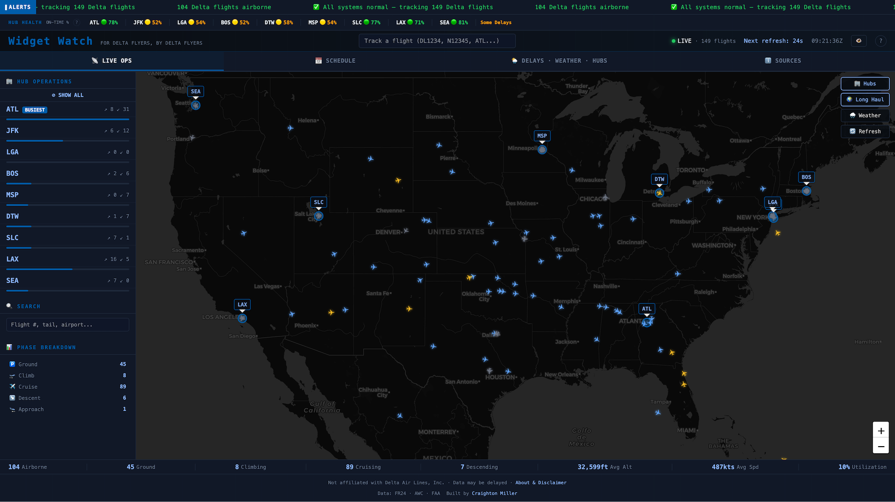

# ✈️ Widget Watch

**An unofficial, real-time operations dashboard for Delta Air Lines — built by flyers, for flyers.**

**[→ Live Dashboard](https://widgetwatch.org)** · **[📋 Changelog](CHANGELOG.md)** · **[💡 Suggest a Feature](https://github.com/craighton/widgetwatch/issues)**



---

## What Is This?

Widget Watch is a fan-built operations dashboard that lets you see Delta Air Lines like an ops center would — live flight positions, hub schedules, fleet data, delays, weather, and stats, all in one dark, data-dense interface.

**Not affiliated with Delta Air Lines, Inc.** This is an independent project by an aviation enthusiast.

---

## Features

### 📡 [Live Ops](https://widgetwatch.org#live)
Real-time map tracking 600+ Delta flights, updated every 30 seconds. Filter by hub, toggle longhaul routes, overlay NEXRAD weather radar. Hub status sidebar shows departure/arrival counts and identifies the busiest hub. Search any flight by number, tail, or route. Great circle route lines show flight paths with city names.

### ⚠️ IRROPS Monitor
Server-side disruption scoring across all 9 hubs — cancellations, delays (30m/60m), diversions, and FAA ground stops. Preloaded automatically on page load with 5-minute server-side caching. No manual trigger needed.

### 📅 [Schedule](https://widgetwatch.org#schedule)
Departure and arrival boards for all 9 DL hubs (ATL, JFK, LGA, BOS, DTW, MSP, SLC, LAX, SEA). Filter by status or aircraft type. Equipment swap detection flags when a plane type changes. On-time performance stats. All times in airport-local timezone.

### ✈️ [Fleet](https://widgetwatch.org#fleet)
Complete database of 1,078+ mainline aircraft — searchable and sortable by type, registration, seat config, WiFi, and IFE. Filters by fleet, type, and operator. Live fleet status correlates airborne flights with the database.

### 🌦 [Delays · Weather · Hubs](https://widgetwatch.org#weather)
FAA NAS delay and ground stop alerts, METAR observations with plain-English explainers, NEXRAD radar overlay, and hub health indicators. Each hub gets a unified card with conditions, visibility, wind, ceiling, and current delay status. **Ops Impact Assessment** goes beyond standard flight categories to flag real operational risks — snow, gusts, freezing precipitation, thunderstorms — even when conditions are technically VFR. Radar map renders instantly; weather data loads in parallel via batched API calls.

### 📊 [Stats](https://widgetwatch.org#stats)
Live fleet utilization by aircraft type (airborne vs. total), flight phase distribution (climb/cruise/descent donut chart), hub-to-hub traffic flow matrix, top active routes, fleet delivery timeline with stacked histogram colored by aircraft family, and Wifi coverage metrics. All live data updates every 30 seconds.

### 🔍 Flight Search
Look up any Delta flight number from the header search bar. Returns live position, route, aircraft details, and scheduled/actual times via the official Flightradar24 API.

### More
- **Deep-link hashes** — Share direct links to any tab (`#live`, `#schedule`, `#fleet`, `#weather`, `#stats`)
- **Flight watch** — Pin a flight and get browser push notifications on status changes
- **Hub health bar** — At-a-glance on-time performance across all 9 hubs, with cancellation rate detection (shows `100% CX` when a hub is shut down)
- **Equipment swap alerts** — Badges when scheduled aircraft type changes
- **📱 Mobile-first design** — Map-maximized layout with bottom tab bar navigation, collapsible filters
- **PWA support** — Installable as a home screen app on iOS/Android with offline caching
- **Click the title** — "WIDGETWATCH" header always takes you back to Live Ops

---

## Architecture

```
┌─────────────────────────────────────────────────────┐
│                    Browser (SPA)                    │
│                                                     │
│  public/index.html — single-file dark NOC dashboard │
│  ├── Leaflet map + CartoDB dark tiles               │
│  ├── NEXRAD radar tile overlay                      │
│  ├── Event delegation (data-action attributes)      │
│  ├── Fleet data loaded async from /data/            │
│  └── All API calls go through server-side proxies   │
└──────────────┬──────────────────────────────────────┘
               │
    ┌──────────▼────────────────────────────────┐
    │        Vercel Serverless Functions        │
    │                                           │
    │  /api/schedule    — FR24 schedule proxy   │
    │                     (cached, rate-limited │
    │                      DL-filtered)         │
    │  /api/irrops      — Precomputed IRROPS    │
    │                     metrics (5min cache)  │
    │  /api/fr24-feed   — Live flight positions │
    │  /api/fr24-flight — Flight lookup         │
    │                     (official FR24 API)   │
    │  /api/metar       — AWC weather proxy     │
    │                     (batched, all hubs)   │
    │  /api/faa         — FAA NAS status proxy  │
    │  /api/fleet       — Fleet data proxy      │
    └───────────────────────────────────────────┘
```

### Why Server-Side Proxies?

- **Rate limiting** — One server fetches data for all users, not 500 browsers hammering APIs independently
- **Caching** — Schedule data cached 60s (live) / 5min (historical), IRROPS cached 5min, reducing upstream load by 90%+
- **DL filtering** — Server filters to Delta flights only, shrinking payloads dramatically
- **CORS** — Some sources (AWC, FAA) don't allow direct browser requests
- **Batching** — METAR data for all 9 hubs fetched in a single request

---

## Data Sources

| Source | Data | Freshness | Notes |
|--------|------|-----------|-------|
| [Flightradar24](https://flightradar24.com) | Live positions, schedules, flight lookup | ~15s–60s | Server-side proxy with caching |
| [Aviation Weather Center](https://aviationweather.gov) | METAR observations | ~5min | NOAA/CORS proxy, batched |
| [FAA NAS Status](https://nasstatus.faa.gov) | Delays & ground stops | ~5min | XML→JSON proxy |
| [Iowa State NEXRAD](https://mesonet.agron.iastate.edu) | Radar imagery | ~5min | Direct tile server |

---

## Tech Stack

- **Frontend:** Vanilla HTML/CSS/JS — single-file dashboard, Astro-templated hub pages
- **Map:** [Leaflet](https://leafletjs.com) + CartoDB dark tiles
- **Radar:** Iowa State NEXRAD WMS tiles
- **Font:** [JetBrains Mono](https://www.jetbrains.com/lp/mono/)
- **Build:** [Astro](https://astro.build) (static site generator for hub pages)
- **Hosting:** [Vercel](https://vercel.com) (serverless functions + edge CDN)
- **Analytics:** Vercel Web Analytics + Speed Insights
- **Design:** Dark theme, inspired by Bloomberg terminals and airline ops centers

---

## Security

- **Content Security Policy** — Strict CSP via Vercel headers with `default-src 'self'`, `frame-ancestors 'none'`, and scoped source directives
- **Security headers** — `X-Frame-Options: DENY`, `X-Content-Type-Options: nosniff`, `Referrer-Policy`, `Permissions-Policy`
- **XSS protection** — All dynamic API data is HTML-escaped before DOM insertion (including single quotes). Zero inline event handlers — all interaction via delegated `data-action` attributes.
- **CORS** — API endpoints locked to `widgetwatch.org` origin
- **Input validation** — All API parameters validated and sanitized server-side
- **Tabnabbing protection** — All external links use `rel="noopener noreferrer"`

---

## Project Structure

```
├── src/
│   ├── layouts/
│   │   └── HubLayout.astro  # Shared hub page template (CSS, footer, live script)
│   ├── pages/
│   │   ├── 404.astro        # Branded "Flight not found" 404 page
│   │   └── hubs/
│   │       └── [hub].astro  # Dynamic route → generates all 9 hub pages
│   └── data/
│       └── hubs.js          # Hub metadata, content, SEO, schemas (all 9 hubs)
├── public/
│   ├── index.html       # The entire dashboard (single file)
│   ├── data/
│   │   └── fleet.json   # Fleet database
│   ├── og-image.png     # Social media preview image (1200×630)
│   ├── manifest.json    # PWA manifest
│   ├── sw.js            # Service worker (split caches, offline support)
│   ├── icons/           # PWA app icons (192px, 512px)
│   ├── robots.txt       # Search engine directives (blocks /api/ and /data/ from crawlers)
│   └── sitemap.xml      # Sitemap (homepage + all hub pages)
├── api/
│   ├── schedule.js      # FR24 schedule proxy (cached, rate-limited, DL-filtered)
│   ├── irrops.js        # Server-side IRROPS aggregation (all hubs, 5min cache)
│   ├── fr24-feed.js     # FR24 live flight feed proxy
│   ├── fr24-flight.js   # FR24 official API flight lookup
│   ├── metar.js         # AWC METAR weather proxy (supports batched station IDs)
│   ├── faa.js           # FAA NAS status proxy (XML → JSON)
│   └── fleet.js         # Fleet data proxy
└── vercel.json          # Vercel config + security headers + CSP + caching
```

---

## 💡 Feature Requests & Contributing

Got an idea? Found a bug? **[Open an issue →](https://github.com/craighton/widgetwatch/issues)**

The community drives this project. Some of the best features came from user suggestions on Reddit and FlyerTalk. PRs welcome too — it's a single HTML file, so the barrier to entry is low.

---

## Disclaimer

**Widget Watch is not affiliated with, endorsed by, or connected to Delta Air Lines, Inc.** "Delta Air Lines" and the Delta logo are trademarks of Delta Air Lines, Inc.

All flight data is provided for informational purposes only and may be delayed, incomplete, or inaccurate. **Do not use this dashboard for operational or safety-critical decisions.** Always verify flight status directly with [delta.com](https://www.delta.com).

---

## License

MIT — see [LICENSE](LICENSE) for details.

---

*Original source code by [Jonah Berg](https://github.com/notjbg)*
